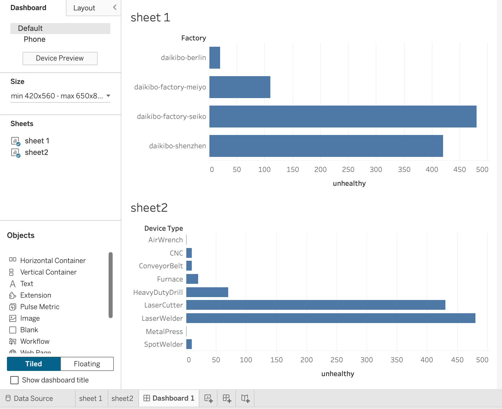

# Machine Downtime Analysis Dashboard (Tableau)

An interactive Tableau dashboard developed to analyze machine downtime across multiple factories and identify high-failure devices.

---

## 📌 Overview
This project analyzes machine telemetry data to understand downtime patterns across factories and machine types. The objective is to identify performance issues and highlight areas that need attention.

---

## 🛠️ What I Did
- Cleaned and prepared the dataset using Excel  
- Created calculated fields to measure downtime  
- Built an interactive dashboard using Tableau  
- Compared downtime across factories and device types  

---

## 📊 Key Insights
- Identified the factory with the highest downtime  
- Found the most frequently failing machine types (e.g., LaserWelder, LaserCutter)  
- Enabled quick comparison of performance across locations  

---

## 🧰 Tools Used
- Tableau  
- Excel  

---

## 📂 Files Included
- `Machine_Downtime_Dashboard.twbx` – Tableau packaged workbook  
- `dashboard.png` – Dashboard preview  

---

## 📷 Dashboard Preview

---

## 🚀 Outcome
This project strengthened my ability to analyze real-world data, build dashboards, and derive actionable insights for decision-making.
